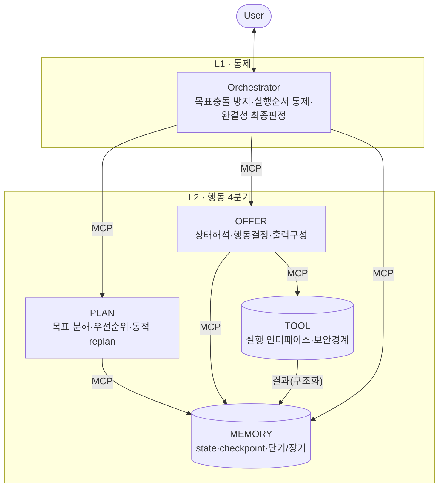

# 멀티에이전트 오케스트레이터 — 범용 설계 템플릿 v0.1

> 작성 2026-06-16. **유저 초안 → 에이전트 검토·보강** 산출물.
> 특정 프로젝트에 국한하지 않는 **재사용 가능한 초기 템플릿**. 첫 적용(reference instance)은
> 비교·분석 워크플로우(비교기준정의 → 항목추출 → 차이분석 → 결과요약).
> 계층 간 통신은 **MCP 서버 호출**을 기본 substrate로 한다.
> 구현 골격은 `constgx/agents/`(orchestrator.py·verifier.py·tools.py)에 매핑 — 본 문서는 그 스키마 정본.

---

## 0. 한눈에

- **계층형 2계층 / 5역할.** L1 = Orchestrator(CTO, 유저와 소통·실행순서 통제). L2 = OFFER·TOOL·MEMORY·PLAN.
- **단일 진실 객체 = `AgentContext`**(경량 히스토리 포함). 모든 역할은 이걸 읽고, *자기 소관 필드만* 쓴다.
- **계층 간 호출 = MCP.** 역할이 다른 역할/도구를 부르는 모든 경로가 MCP 호출 → 전건 로깅·권한경계·검증 지점이 공짜로 생긴다.
- **3대 통제**를 구조에 못박는다: 실행경로통제(방향고정)·완결성검증(종료판정)·우선순위결정.
- **실패를 1급 시민으로.** 성공/실패별 핸드오프 + DIAGNOSIS 표 + 유계재시도 + 차단기.

---

## 1. 설계 원칙 (초안 검토 + 보강)

유저 초안의 골격(2계층 5역할, 역할별 책임, 실행 흐름, 종료조건)을 **그대로 채택**한다. 아래는 빠진 계층을 보강한 것:

1. **AgentContext(공유 실행상태)를 1급 구조로.** 초안의 MEMORY가 "보존"을 맡지만, 역할 간 *주고받는 객체*의 스키마가 없으면 핸드오프가 흐트러진다. 경량 히스토리 포맷을 여기에 정의한다.
2. **역할별 행동제약 스키마.** 각 역할이 *무엇을 읽고/쓰고/호출할 수 있는가*를 명시 → 역할 침범 방지(초안의 "행동 제약 스키마" 요구를 구체화).
3. **운영 3축(보안·품질·비용)을 횡단 관심사로.** 초안이 TOOL의 보안경계를 언급했는데, 이를 전 역할에 걸치는 정책으로 승격(HITL·안전필터·최소권한·감사로깅 / 완결성검증 / 컨텍스트 최소화·캐싱·모델 계층화).
4. **종료=무한루프 방지 3원칙.** ①모든 작업단위가 종료상태(DONE/FAILED)로 끝남 ②유계재시도+새 증거(corrective 적용 후에만 재시도) ③연속실패 차단기. 조기·중도 종료 시 state 자동 checkpoint(초안 요구 반영).
5. **유형 확장성.** v1은 계층형이지만 같은 AgentContext·핸드오프 규약 위에서 경쟁형·이벤트기반·병렬로 확장 가능하게 슬롯을 비워둔다.

---

## 2. 아키텍처 — 계층 & MCP 호출 토폴로지



**MCP 경계 배치 (핵심 결정).**
- **TOOL·MEMORY는 반드시 MCP 서버.** 둘은 *부작용*(외부 I/O, 상태 영속)을 가진 보안경계라, MCP 서버로 분리하면 ①최소권한 화이트리스트 ②전 호출 감사로깅 ③구조화 반환이 강제된다.
- **OFFER·PLAN은 추론(LLM) 역할.** v1에서 선택지 둘:
  - (a) Orchestrator 프로세스 내 함수 — 단순·저비용. MCP 호출은 "도구·상태 접근"에만 한정.
  - (b) 각각 독립 MCP 서버 — 호출 계층이 전부 가시화돼 **포트폴리오/데모 가치가 큼**(유저가 "계층 간 MCP 호출"을 명시한 의도에 부합). 비용↑·복잡도↑.
  - → 권장: **v1=(a)로 빠르게 동작 검증 → v2에서 OFFER/PLAN을 (b)로 승격.** (4절 결정필요 참조)
- **배포 형태**: v1은 **단일 MCP 게이트웨이 + 역할 네임스페이스**(`tool.*`, `memory.*`)로 단순하게. 확장 시 역할별 서버로 분리.

---

## 3. AgentContext — 단일 진실 객체 (경량 히스토리 포함)

역할 간 주고받는 단 하나의 구조. **history는 원문이 아니라 digest**만 담아 컨텍스트 희석을 막는다(OFFER의 "필요 정보만 선별" 요구를 구조로 강제).

```jsonc
{
  "goal": "사용자 최상위 목표 (불변 — Orchestrator만, 사용자 합의 시에만 변경)",
  "constraints": {
    "definition": { /* 작업 초기 정의: 예) 비교기준 목록 */ },
    "allowed_tools": ["..."],        // 최소권한 화이트리스트
    "forbidden": ["rm -rf", "DROP TABLE", "..."],  // 안전필터
    "acceptance": { /* 완결성 기준: 충족해야 '끝'으로 판정 */ }
  },
  "plan": [
    { "step_id":"s1", "subgoal":"...", "priority":1, "depends_on":[], "status":"pending|running|done|failed" }
  ],
  "state": {
    "cursor": "s1",                  // 현재 단계
    "artifacts": { /* 단계 산출물(또는 외부저장 포인터) */ },
    "scratch": { /* OFFER의 휘발성 작업메모 */ }
  },
  "history": [
    { "t":"2026-06-16T..","actor":"OFFER","action":"call_tool:extract",
      "input_digest":"sha+요약","result_digest":"요약","status":"ok|fail","cause":null }
  ],
  "budget": { "iter":0, "max_iter":12, "deadline":"ts", "tokens":0 },
  "verdict": null                    // 완결성검증 결과(통과 전 null)
}
```

장기 보존이 필요한 항목은 `artifacts`에 **포인터**(파일/DB/GCS 경로)만 두고 본문은 외부에 — MEMORY 장단기 분리(7절).

---

## 4. 역할별 책임 + 행동제약 스키마

각 역할은 `reads`(읽기 허용 필드) / `writes`(쓰기 허용 — 나머지는 불변) / `may_call`(MCP로 호출 가능) / `must_not`(금지) / `invariants`(불변식)로 못박는다.

### Orchestrator (L1, CTO)
- **책임**: 유저와 소통. 목표 간 충돌 방지, 실행순서 통제, **완결성 최종판정**(verdict).
- reads: 전체 · writes: `goal`,`constraints`,`verdict`,`budget` · may_call: PLAN, OFFER, MEMORY
- must_not: TOOL **직접 실행**(반드시 OFFER 경유), 사용자 합의 없는 goal 변경
- invariants: goal 불변 유지 · 단계 간 충돌 시 중재·재정렬 · 종료조건 소유

### PLAN
- **책임**: 상위 목표 → 수행가능 하위단계 분해, 우선순위 정의, **동적(실시간) 계획 수정**.
- reads: `goal`,`constraints`,`state` · writes: `plan` · may_call: MEMORY(읽기)
- must_not: artifacts 생성, TOOL 호출(실행은 안 함)
- invariants: 모든 subgoal은 `acceptance`로 **검증가능**해야 함 · priority·depends_on 부여 · 새 state 들어오면 replan

### OFFER (추론·의사결정)
- **책임**: 입력 해석·현재상태 이해 → 다음 작업 제안 + 필요도구 호출 판단. 상태해석/행동결정/출력구성.
- reads: `goal`,`constraints`,`plan`,`state`,`history(digest)` · writes: `state.scratch`, 제안 action · may_call: TOOL, MEMORY
- must_not: **최종 완결판정**(그건 Orchestrator), constraints 위배 도구 선택
- invariants: 도구선택이 `constraints.definition`에 **위배되면 스스로 거부**(실행경로통제 1차 방어) · 컨텍스트 윈도우 고려해 **필요 정보만 선별**

### TOOL (실행 인터페이스·보안경계)
- **책임**: 데이터조회·파일처리·코드실행·외부 API 등 OFFER 판단을 시스템 동작으로 변환.
- reads: action spec · writes: `state.artifacts`, 구조화 result · may_call: 외부 시스템(화이트리스트 한정)
- must_not: 정의된 인터페이스 **외 시스템 접근**(최소권한), `forbidden` 매칭 작업 실행
- invariants: 모든 호출 **로그** · 반환은 **구조화 데이터**(acceptance 평가가능) · 파괴적 작업은 **HITL 게이트** 통과 후에만

### MEMORY (상태유지·지속성)
- **책임**: 이전 상호작용·결과 보존(state, checkpoint).
- **단기**: 현재 세션 맥락 → LLM 입력에 포함. 중요 데이터는 사용자 저장요청 시 별도 관리.
- **장기**: 세션 종료 후 유지(사용자 선호·반복요구·히스토리) → 외부 저장소 연동.
- reads/writes: `state`,`history`,checkpoint · must_not: 판단·도구실행
- invariants: **모든 종료(정상·조기·중도)에서 state 자동 checkpoint** · 멱등(같은 키 재기록 안전)

---

## 5. 3대 통제 개념 — 어디에 박히는가

| 통제 | 정의 | 구현 위치(다중 방어) |
|---|---|---|
| **실행경로통제**(방향고정) | 중간판단에 따른 도구선택이 초기 정의에 위배되지 않게 | ①Orchestrator가 `goal`/`constraints`를 불변 고정 → ②OFFER가 매 도구선택을 `constraints`에 대조·거부 → ③TOOL이 `allowed_tools`/`forbidden`으로 2차 차단 |
| **완결성검증**(종료판정) | 최종결과가 요구조건을 충족했는지 | Orchestrator(겸 Verifier)가 결과에 `acceptance` 적용 → `verdict`. 미충족 시 PLAN replan 또는 FAILED 종료. self-verification의 `verify(result, acceptance)` |
| **우선순위결정** | 여러 선택지 중 먼저 할 것 | PLAN이 `priority`+`depends_on`으로 순서 결정. 단계 간 충돌은 Orchestrator가 중재 |

---

## 6. 실행 루프 & 핸드오프 프로토콜

### 기본 흐름 (유저 초안)
```
목표 수립(ORC) → PLAN 분해 → OFFER가 state 참조해 도구호출 판단 →
TOOL 실행 → 결과를 MEMORY에 공유·전달 → PLAN이 갱신 state로 계획 수정·유지 → (반복)
```

### 핸드오프 — 의존성 강화 + 확산 전달
- **성공 핸드오프**: 산출물 digest + 갱신 state를 다음 역할로. 다음 에이전트는 이전 결과를 **입력 계약**으로 받음(의존성 강화).
- **확산 전달패턴(fan-out)**: 하나의 결과(예: *비교기준*)를 **공통 기준**으로 여러 후속(대상별 *항목추출* N건)에 펼친 뒤, 각 결과를 같은 `acceptance` 스키마로 **수렴**. → 한 결과를 공통 기준으로 확장.
- **실패 핸드오프**: `result.status=fail` + 원인코드 → **DIAGNOSIS 표**로 `(retriable?, corrective)` 매핑 →
  - retriable: corrective 파라미터 적용해 **유계 재시도**(새 증거 생길 때만).
  - 미진단: **FAILED + halt** (재시도 금지) → 진단표에 항목 추가(자기학습).
  - 연속 K회 실패: **차단기 발동**, 루프 정지.

### 종료조건 (무한루프 방지 3원칙)
최대 반복(`max_iter`) 도달 · 완결성검증 통과(품질) · `deadline` 초과(타임아웃) · 연속실패 차단기.
**모든 종료 분기에서 MEMORY가 state checkpoint** → 재개는 멱등.

---

## 7. 운영 3축 (횡단 관심사)

- **보안**: 최소권한(TOOL `allowed_tools` 화이트리스트) · 룰기반 안전필터(`forbidden` 사전차단, 예 `rm -rf`/`DROP TABLE`) · **HITL**(파괴적 작업) · 감사로깅(MCP 호출 전건 JSONL) · 정책검토. ※ 룰기반 verifier는 *사후 출력검증*일 뿐 *사전 안전검증* 아님 — 둘 다 필요.
- **품질**: `acceptance` 기반 완결성검증 / LLM-as-Judge / 회귀평가.
- **비용**: history digest로 컨텍스트 최소화 · 캐싱 · 모델 계층화(OFFER 추론=대형 LLM, 단순 변환/요약=SLM).

---

## 8. 첫 적용 — 비교·분석 워크플로우 (reference instance)

목표 예: "A·B·C를 비교하라."
1. **비교기준 정의** → `constraints.definition`에 기준 목록 고정(ORC+PLAN).
2. **PLAN 분해**: `[기준정의] → [항목추출×대상] → [차이분석] → [결과요약]`, 각 단계에 acceptance 부여.
3. **항목추출 = 확산전달(fan-out)**: 공통 기준으로 대상별 TOOL 호출, 결과를 공통 스키마로 수렴.
4. **차이분석**: 수렴 항목 비교(OFFER 추론 + 필요 시 TOOL).
5. **결과요약**: 완결성검증(`모든 기준 커버`·`출처 존재` 등) 통과 후에만 출력.

→ 기존 `skills/research/competitor-analysis`와 연결되는 워크플로우라 재사용 가치가 큼.

---

## 9. 검토 의견 / 결정 필요 (유저 판단 요청)

1. **OFFER/PLAN의 MCP화 시점** — v1 in-process(빠름) vs 처음부터 독립 MCP 서버(데모가치↑·비용↑). → 권장: v1 in-process, v2 승격. **포트폴리오에서 "계층 간 MCP 호출"을 전면에 내세우고 싶으면 처음부터 분리**도 합리적.
2. **MCP 배포 형태** — 단일 게이트웨이+네임스페이스(v1) vs 역할별 서버(확장).
3. **MEMORY 장기 백엔드** — 로컬 파일 / SQLite / 외부(GCS·DB) 중 택.
4. **Verifier 분리 여부** — 5역할 고정이면 Orchestrator가 완결성검증 겸임. 독립 6번째 역할로 빼면 책임이 더 깔끔(품질축 강화).

---

## 10. 다음 단계

1. 위 4개 결정 확정 → 본 스키마를 `constgx/agents/`의 orchestrator·verifier·tools 골격 슬롯에 매핑.
2. **모의 도구로 비교 워크플로우 1회 통과**(happy path + 의도적 실패 1건으로 DIAGNOSIS·차단기 검증).
3. 모의 도구를 **실 MCP 서버**(TOOL·MEMORY)로 교체.
4. GAP-ANALYSIS 🔴 갭(AgentContext·HITL·안전필터·최소권한·MCP검증)이 본 템플릿 슬롯으로 모두 흡수됐는지 최종 대조.

---
_v0.1 2026-06-16 — 유저 초안 검토·보강 초판. 결정필요 4건 확정 후 v0.2에서 코드 골격 매핑._
